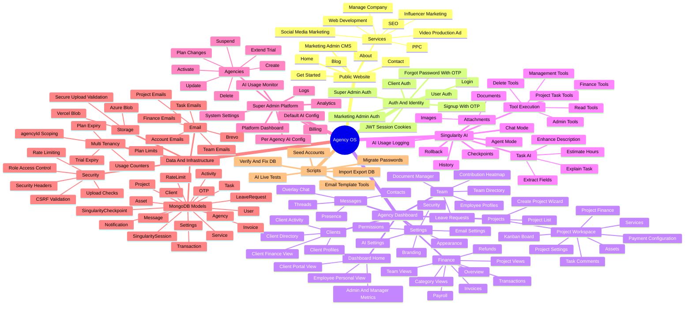
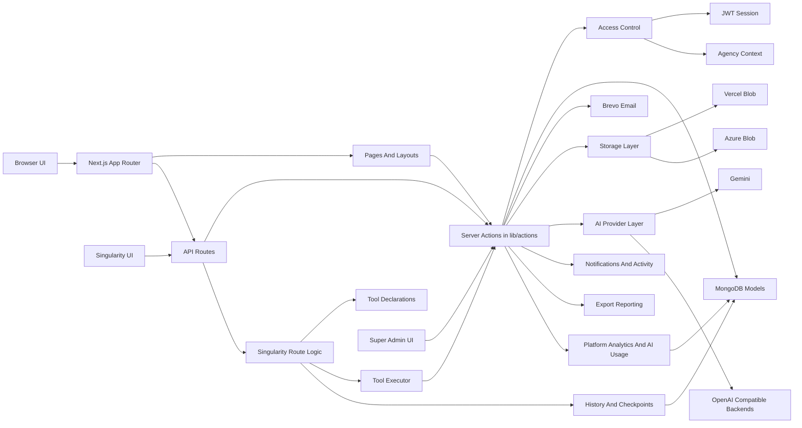

# Whole Project Mind Map

The diagrams below give a visual summary of the current project.

## 1. Product Mind Map

## 2. Architecture Flow

## 3. Fast Interpretation Guide

- Public routes generate leads, content, and agency signups.
- Dashboard routes handle day-to-day agency operations under agency scope.
- Super-admin routes operate above agencies and manage the platform itself.
- Server actions are the main business-logic layer.
- MongoDB is the core data store, while Brevo, storage adapters, and AI providers are external integrations.
- Singularity is layered on top of the same action and data model, with extra history and rollback support.
